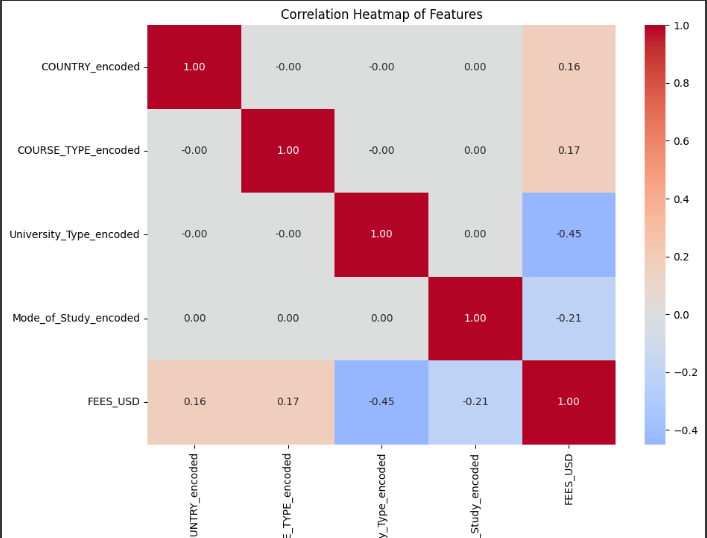
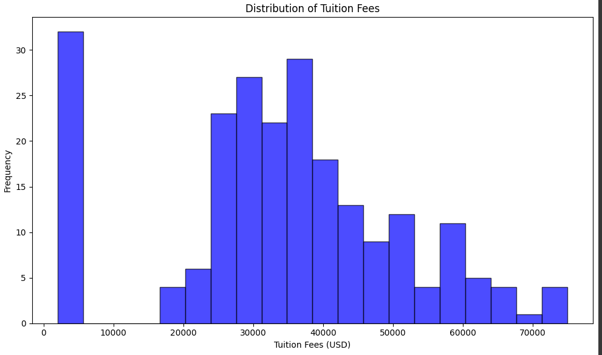

# Cost My Degree: International Tuition Fee Predictor

<p align="center">
  
  &nbsp;&nbsp;&nbsp;&nbsp;
  
  &nbsp;&nbsp;&nbsp;&nbsp;
  
</p>

## Overview
An AI-powered application that predicts masters program for international university tuition fees based on various factors including country, course type, university type, and mode of study.

## My Mission:
To make quality education accessible to everyone by providing transparent, data-driven insights into international tuition fees, empowering individuals to make informed decisions and achieve their dreams of higher education without financial barriers.

## Source:
Kaggle https://www.kaggle.com/datasets/shivampawale/abroad-study-cost-predictor/data
*Edited dataset by adding different fields for variation and but retained original information

## Demo
https://www.loom.com/share/4a1e07d6a0004e078ad74fe28a6d268e?sid=36e91170-acb8-4c1c-948f-4818d474b75b

## Table of Contents
- [Features](#features)
- [Data Analysis](#data-analysis)
- [API Documentation](#api-documentation)
- [Installation](#installation)
- [Contribution](#contributing)

## Features
- Predict tuition fees for international students
- Compare costs across different countries
- User-friendly mobile interface

## Data Analysis

### Correlation Heatmap

The heatmap reveals relationships between features and tuition fees. University Type shows the strongest correlation (-0.45), indicating private universities tend to have higher fees. Mode of Study shows a moderate negative correlation (-0.21), suggesting online programs generally cost less.

### Fee Distribution

The histogram shows a bimodal distribution of tuition fees. The first peak (around $2,000-$5,000) represents public universities in countries like Germany and France. The second peak ($30,000-$40,000) represents private universities and institutions in countries like the USA and UK.


## API Documentation
API endpoint: https://predict-tuition.onrender.com/docs

### Prediction Endpoint
```https://predict-tuition.onrender.com
POST /predict

### Request Body:
{
    "country": "USA",
    "course_type": "Computer Science",
    "univ_type": "Public",
    "mode_of_study": "Full-time"
}

{
  "predicted_fee": 45000.00,
  "currency": "USD"
}

### Installation

Prerequisites
Flutter SDK: Install Flutter
Dart: Comes with Flutter.
Backend Hosting: The API is hosted on Render

1. Clone the repository
```bash
git clone https://github.com/julianacholder/linear_regression_model
```

2. Navigate to the project directory
```bash
cd costmydegree
```

3. Install dependencies
```bash
flutter pub get
```

3. Run the App
```bash
flutter run
```

## Contributing

1. Fork the repository
2. Create your feature branch (`git checkout -b feature/AmazingFeature`)
3. Commit your changes (`git commit -m 'Add some AmazingFeature'`)
4. Push to the branch (`git push origin feature/AmazingFeature`)
5. Open a Pull Request

## 📝 License

This project is licensed under the MIT License - see the [LICENSE](LICENSE) file for details.

## 👨‍💻 Author

Juliana Crystal Holder
- GitHub: [@julianacholder](https://github.com/julianacholder)
- LinkedIn: [Juliana Crystal Holder](https://linkedin.com/in/julianacrystal)

## 🌟 Show your support

Give a ⭐️ if this project helped you!

